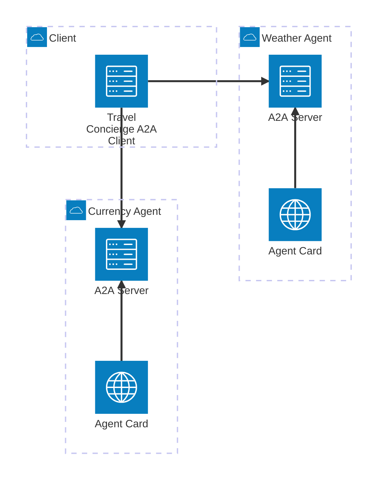
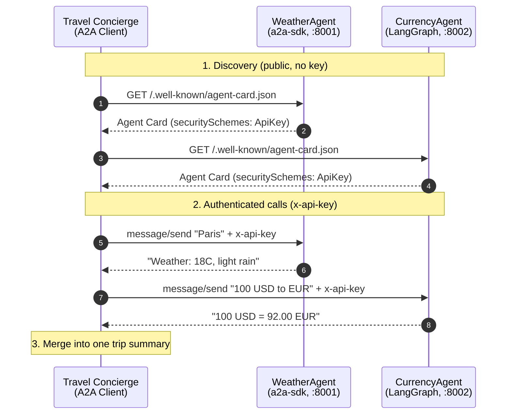
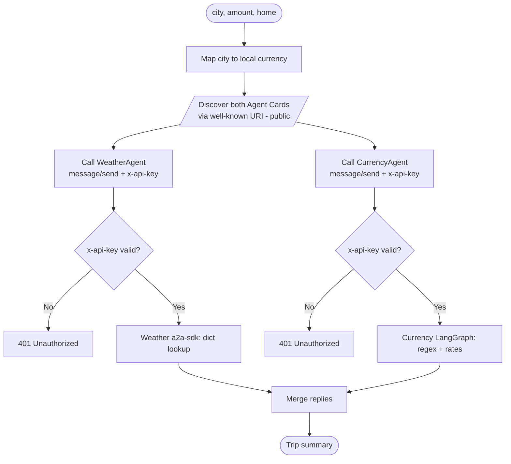

# A2A Travel Concierge — Proof of Concept

A tiny, **fully offline** project that demonstrates the **Agent2Agent (A2A)** protocol end to end — discovery, client/server messaging, multi-agent orchestration, and authentication — with **no LLM credits, no deployment platform, and no marketplace** required.

This README is also a quick primer: by the end you should understand *what A2A is*, *why it's useful*, *which frameworks can build A2A agents and clients*, and *how this PoC works*.

---

## Contents
- [What is A2A?](#what-is-a2a)
- [Why A2A helps](#why-a2a-helps)
- [Core A2A concepts](#core-a2a-concepts)
- [A2A is framework-agnostic](#a2a-is-framework-agnostic)
- [About this PoC](#about-this-poc)
- [Diagrams](#diagrams)
- [Project structure](#project-structure)
- [Setup](#setup) · [Run](#run) · [Auth](#auth--how-it-works) · [Verify](#verify)
- [What this PoC demonstrates](#what-this-poc-demonstrates)
- [Stretch ideas](#stretch-ideas) · [References](#references)

---

## What is A2A?

**A2A (Agent2Agent)** is an open protocol that lets independent AI agents **discover and talk to each other** — even when they are built by different teams, on different frameworks, in different languages, and hosted in different places.

Think of it as the agent equivalent of **HTTP for the web**: just as HTTP let any browser talk to any web server, A2A lets any agent (or agent orchestrator) call any other agent over a **standard interface**.

It is built on familiar web technology — **HTTP + JSON-RPC** (with optional gRPC and Server-Sent Events) — so it works with existing infrastructure. A2A was introduced by Google (2025), is backed by IBM and a large partner ecosystem, and is now governed by the **Linux Foundation** (vendor-neutral).

> **A2A vs. MCP:** They're complementary. **MCP** (Model Context Protocol) connects a *single agent* to its tools/data/APIs (vertical). **A2A** connects *agents to each other* as peers (horizontal). An agent can use MCP internally and expose itself via A2A externally.

## Why A2A helps

- **Interoperability** — a client built with one framework can call a server built with a completely different one. No bespoke, per-partner integration code.
- **Discovery** — every agent publishes a machine-readable **Agent Card** at a well-known URL, so callers can find it and learn its skills + auth requirements automatically.
- **Composability** — agents can be chained and nested. An "orchestrator" agent can delegate sub-tasks to specialist agents (exactly what this PoC does).
- **Open + low lock-in** — a public standard under the Linux Foundation; you don't bet your integration on one vendor.

## Core A2A concepts

| Concept | What it is |
|---------|-----------|
| **Agent** | A service that can perform tasks. Its "brain" may be an LLM, rules, or (here) a stub. |
| **A2A Server** | An agent exposed over A2A at an HTTP endpoint. |
| **A2A Client** | The caller that discovers and invokes A2A servers. An agent can be **both** a server and a client. |
| **Agent Card** | JSON metadata served at `/.well-known/agent-card.json` — name, URL, **skills**, and **security schemes**. The basis of discovery. |
| **Skill** | A capability the agent advertises (id, description, examples). |
| **Message / Task** | A `message/send` call carries a Message; long-running work is tracked as a **Task** with a status lifecycle (submitted → working → completed/failed). |
| **Execution modes** | **Synchronous** (wait for reply — used here), **Streaming** (SSE), **Asynchronous** (poll a task), **Push notifications** (webhook callbacks). |
| **Security schemes** | The Agent Card declares required auth (API key, OAuth2/OIDC, mTLS). Credentials are sent in HTTP headers. |

## A2A is framework-agnostic

A key point of A2A: **the protocol is independent of the framework used to build the agent.** Because both sides just speak HTTP + JSON-RPC and exchange a standard Agent Card, **a server and a client written with different tools interoperate seamlessly.**

A2A agents and clients can be built with, among others:

| Framework / SDK | Build A2A **server** | Build A2A **client** | Notes |
|-----------------|:---:|:---:|------|
| **Official A2A SDKs** — Python (`a2a-sdk`), JavaScript/TypeScript, Java, .NET, Go | ✅ | ✅ | Lowest-level, direct protocol access. |
| **Google ADK** (Agent Development Kit) | ✅ | ✅ | `to_a2a()` to serve; `RemoteA2aAgent` to call. |
| **LangGraph** | ✅ | — | Builds agent logic served via the A2A SDK executor (this PoC's Currency agent); use the A2A SDK for client calls. |
| **BeeAI Framework** | ✅ | ✅ | `A2AServer` to serve; `A2AAgent` to call/orchestrate. |
| **Microsoft Agent Framework** | ✅ | ✅ | Cross-ecosystem client/server support. |
| **CrewAI, LlamaIndex, Semantic Kernel, AutoGen, …** | ✅ | ✅ | Growing list of integrations; support varies. |

> ✅ = a known way to fill that role (natively, or by pairing the framework's agent with the A2A SDK). Support varies and the ecosystem moves fast — check **[a2a-protocol.org](https://a2a-protocol.org)** for the current list.

**What *this* PoC uses — two *different* frameworks on purpose:**
- **Weather agent** (`weather_agent.py`): built **directly with the official `a2a-sdk`** (plain stub logic, no agent framework), on Starlette + uvicorn.
- **Currency agent** (`currency_agent.py`): agent logic built with **LangGraph** (a deterministic `StateGraph`, no LLM), exposed over A2A via the `a2a-sdk` server layer.
- **Client / orchestrator** (`concierge.py`): `a2a-sdk` client over **httpx**; orchestration is **plain Python (rule-based, no agent framework, no LLM)**.

The same client calls **both** agents **identically** even though they are built with different frameworks — that interoperability is the whole point of A2A. You could likewise swap either agent for one built with ADK or BeeAI without changing the others.

---

## About this PoC

The three "blockers" people assume they need are not actually required to learn A2A:

- **No LLM** — each agent's "brain" is **stubbed** with deterministic logic (a dict lookup / regex), so the PoC exercises the *protocol*, not a model.
- **No deployment platform** — the A2A servers run on **localhost**.
- **No marketplace** — discovery uses the standard **well-known Agent Card URI**; the client fetches the card directly.
- **Simple auth included** — a shared **API key** in an `x-api-key` header.

### What it does
A rule-based **Concierge** (an A2A *client*) discovers two A2A *servers*, calls each with an authenticated request, and merges the replies into one trip summary:

```
Concierge (A2A client, no LLM)  -- x-api-key -->
   ├── discover + call ──> WeatherAgent   (A2A server, :8001)  -> stubbed weather
   └── discover + call ──> CurrencyAgent  (A2A server, :8002)  -> stubbed FX rates
   merge -> "Trip to Paris -> Weather: 18C, light rain | 100 USD = 92.00 EUR"
```

## Diagrams

### Architecture view (structure)

**Weather Agent** uses `a2a-sdk` (port 8001); **Currency Agent** uses **LangGraph** (port 8002). Each Agent Card is served by its own agent; discovery (the cards) is public, while calls to the agents carry the `x-api-key` header.

### Sequence view (time-ordered)


### Flowchart view (logic / auth gate)


## Project structure
| File | Role | Framework / SDK |
|------|------|-----------------|
| `weather_agent.py`  | A2A server on :8001; returns canned weather for a city. | **`a2a-sdk`** + Starlette/uvicorn |
| `currency_agent.py` | A2A server on :8002; converts money via a static rate table. | **LangGraph** logic + `a2a-sdk` transport |
| `concierge.py`      | A2A client/orchestrator; discovers + calls both, merges output. | `a2a-sdk` client + httpx (rule-based) |
| `auth.py`           | Shared API-key middleware + Agent Card security helper. | Starlette + `a2a-sdk` types |
| `requirements.txt`  | Pinned dependencies (`a2a-sdk<1.0`). | — |

## Setup
```bash
cd a2a-poc
python -m venv .venv
# Windows: .venv\Scripts\activate    |    macOS/Linux: source .venv/bin/activate
pip install -r requirements.txt
```
> Note: this PoC pins **`a2a-sdk<1.0`** (v0.3.x, pydantic API).
> `a2a-sdk` 1.x is a protobuf-based rewrite with a different API.

## Run
Use three terminals (servers keep running):
```bash
python weather_agent.py     # terminal 1  -> http://localhost:8001
python currency_agent.py    # terminal 2  -> http://localhost:8002
python concierge.py --city Paris --amount 100 --home USD   # terminal 3
```
Try also: `--city Tokyo --amount 250 --home GBP`.

Expected output:
```
Discovered: WeatherAgent + CurrencyAgent

Trip to Paris ->
   Weather: 18C, light rain
   Money: 100 USD = 92.00 EUR (spend in EUR)
   Have a great trip!
```

## Auth — how it works
- The **Agent Card advertises** the requirement (`securitySchemes` / `security`), so a client can discover *what* auth is needed before it has credentials.
- A small Starlette middleware (`ApiKeyMiddleware`) enforces it: **discovery (`/.well-known/...`) stays public**, every other route needs a valid `x-api-key`, else **HTTP 401**.
- The concierge sends the key on every call. Key defaults to `demo-secret-123`; override with the `A2A_DEMO_KEY` env var (set it the same for all three processes).
- AuthZ (per-tenant scoping) is intentionally **out of scope** for this PoC.

## Verify
```bash
# Discovery is public (no key) and shows the auth requirement:
curl http://localhost:8001/.well-known/agent-card.json

{"capabilities":{"streaming":false},"defaultInputModes":["text"],"defaultOutputModes":["text"],"description":"Provides current weather for a city (stubbed data).","name":"WeatherAgent","preferredTransport":"JSONRPC","protocolVersion":"0.3.0","security":[{"ApiKeyAuth":[]}],"securitySchemes":{"ApiKeyAuth":{"in":"header","name":"x-api-key","type":"apiKey"}},"skills":[{"description":"Returns current weather for a city.","examples":["What's the weather in Paris?","weather Tokyo"],"id":"get_weather","name":"Get Weather","tags":["weather","travel"]}],"url":"http://localhost:8001/","version":"1.0.0"}


# Auth enforced — POST without a key returns 401:
curl -i -X POST http://localhost:8001/ -H "content-type: application/json" \
     -d '{"jsonrpc":"2.0","id":"1","method":"message/send","params":{}}'
	 
HTTP/1.1 401 Unauthorized
date: Sun, 21 Jun 2026 23:34:08 GMT
server: uvicorn
content-length: 54
content-type: application/json

{"error":"unauthorized: missing or invalid x-api-key"}curl: (6) Could not resolve host: \

# End-to-end (authenticated) prints a merged trip summary:
python concierge.py
```

## What this PoC demonstrates
- **Agent Card** + **well-known URI discovery**
- **A2A servers** wrapping agents — a plain stub and a LangGraph graph — via `AgentExecutor` + `A2AStarletteApplication`
- An **A2A client** that resolves cards and sends `message/send`
- **Multi-agent orchestration** (one client chaining two agents)
- **Auth**: card-advertised `securitySchemes` + header enforcement + 401 path
- **Framework-agnostic interoperability** — the two agents use **different frameworks** (`a2a-sdk` for Weather, **LangGraph** for Currency), yet the same client calls both identically.

## Stretch ideas
- Give each agent a **different key** (a taste of AuthZ).
- Wrap `concierge.py` as its **own** A2A server (so it's both client and server).
- Switch a call to **async/streaming** (A2A streaming via SSE) instead of synchronous.
- Add a **third** agent built with **yet another** framework (e.g., Google ADK or BeeAI) to extend the interoperability further. (The Weather + Currency agents already use two different frameworks — `a2a-sdk` and LangGraph.)

## References
- A2A protocol & docs: **https://a2a-protocol.org**
- A2A Python SDK: **https://github.com/a2aproject/a2a-python**

